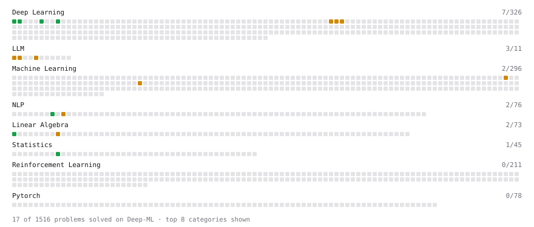

# Deep-ML

My machine learning practice from [Deep-ML](https://www.deep-ml.com). Every solution here was written by hand.

**40** solved · 29 problems · 2 labs · 9 math

[**Browse the interactive portfolio**](https://Abhi-saxena1.github.io/deep-ml/) to replay this filling in over time.

## Problems

| | Difficulty | Solved | |
| --- | --- | --- | --- |
| [Calculate P50/P95/P99 Latency Percentiles](https://www.deep-ml.com/problems/293) | easy | 2026-10-01 | [solution](problems/0293-calculate-p50-p95-p99-latency-percentiles) |
| [Calculate Perplexity for Language Models](https://www.deep-ml.com/problems/320) | easy | 2026-09-28 | [solution](problems/0320-calculate-perplexity-for-language-models) |
| [Character-Level Tokenizer (stoi/itos/BOS)](https://www.deep-ml.com/problems/374) | easy | 2026-10-02 | [solution](problems/0374-character-level-tokenizer-stoi-itos-bos) |
| [Derivatives of Activation Functions](https://www.deep-ml.com/problems/217) | easy | 2026-10-02 | [solution](problems/0217-derivatives-of-activation-functions) |
| [Implement a Simple Residual Block with Shortcut Connection](https://www.deep-ml.com/problems/113) | easy | 2026-10-03 | [solution](problems/0113-implement-a-simple-residual-block-with-shortcut-connection) |
| [Implement ReLU Activation Function](https://www.deep-ml.com/problems/42) | easy | 2026-10-02 | [solution](problems/0042-implement-relu-activation-function) |
| [Implement RMSNorm (Root Mean Square Layer Normalization)](https://www.deep-ml.com/problems/372) | easy | 2026-10-03 | [solution](problems/0372-implement-rmsnorm-root-mean-square-layer-normalization) |
| [Implementation of Log Softmax Function](https://www.deep-ml.com/problems/39) | easy | 2026-10-02 | [solution](problems/0039-implementation-of-log-softmax-function) |
| [Learned Positional Embeddings](https://www.deep-ml.com/problems/375) | easy | 2026-10-02 | [solution](problems/0375-learned-positional-embeddings) |
| [Matrix-Vector Dot Product](https://www.deep-ml.com/problems/1) | easy | 2026-10-01 | [solution](problems/0001-matrix-vector-dot-product) |
| [Sigmoid Activation Function Understanding](https://www.deep-ml.com/problems/22) | easy | 2026-10-02 | [solution](problems/0022-sigmoid-activation-function-understanding) |
| [Softmax Activation Function Implementation ](https://www.deep-ml.com/problems/23) | easy | 2026-10-02 | [solution](problems/0023-softmax-activation-function-implementation) |
| [Bradley-Terry Model for Pairwise Rankings](https://www.deep-ml.com/problems/322) | medium | 2026-09-28 | [solution](problems/0322-bradley-terry-model-for-pairwise-rankings) |
| [Byte Pair Encoding (BPE) Tokenizer](https://www.deep-ml.com/problems/380) | medium | 2026-10-02 | [solution](problems/0380-byte-pair-encoding-bpe-tokenizer) |
| [Elo Rating System for Model Comparison](https://www.deep-ml.com/problems/315) | medium | 2026-09-28 | [solution](problems/0315-elo-rating-system-for-model-comparison) |
| [End-to-End Latency Decomposition](https://www.deep-ml.com/problems/413) | medium | 2026-09-25 | [solution](problems/0413-end-to-end-latency-decomposition) |
| [Implement Layer Normalization for Sequence Data](https://www.deep-ml.com/problems/109) | medium | 2026-10-03 | [solution](problems/0109-implement-layer-normalization-for-sequence-data) |
| [Implement Masked Self-Attention](https://www.deep-ml.com/problems/107) | medium | 2026-10-03 | [solution](problems/0107-implement-masked-self-attention) |
| [Implement Self-Attention Mechanism](https://www.deep-ml.com/problems/53) | medium | 2026-10-03 | [solution](problems/0053-implement-self-attention-mechanism) |
| [Knowledge Distillation Loss](https://www.deep-ml.com/problems/227) | medium | 2026-09-30 | [solution](problems/0227-knowledge-distillation-loss) |
| [LoRA: Low-Rank Adaptation Forward Pass](https://www.deep-ml.com/problems/222) | medium | 2026-09-29 | [solution](problems/0222-lora-low-rank-adaptation-forward-pass) |
| [Matrix times Matrix ](https://www.deep-ml.com/problems/9) | medium | 2026-10-01 | [solution](problems/0009-matrix-times-matrix) |
| [MMLU Log-Probability Scoring](https://www.deep-ml.com/problems/316) | medium | 2026-09-28 | [solution](problems/0316-mmlu-log-probability-scoring) |
| [Pairwise Preference Judge for LLM Comparison](https://www.deep-ml.com/problems/323) | medium | 2026-09-29 | [solution](problems/0323-pairwise-preference-judge-for-llm-comparison) |
| [QLoRA: Quantized Low-Rank Adaptation Forward Pass](https://www.deep-ml.com/problems/223) | medium | 2026-09-30 | [solution](problems/0223-qlora-quantized-low-rank-adaptation-forward-pass) |
| [Rotary Positional Embeddings (RoPE)](https://www.deep-ml.com/problems/381) | medium | 2026-10-03 | [solution](problems/0381-rotary-positional-embeddings-rope) |
| [Rubric-Based LLM Judge Evaluation](https://www.deep-ml.com/problems/317) | medium | 2026-09-29 | [solution](problems/0317-rubric-based-llm-judge-evaluation) |
| [Implement Multi-Head Attention](https://www.deep-ml.com/problems/94) | hard | 2026-10-03 | [solution](problems/0094-implement-multi-head-attention) |
| [Positional Encoding Calculator](https://www.deep-ml.com/problems/85) | hard | 2026-10-02 | [solution](problems/0085-positional-encoding-calculator) |

## Labs

| | Difficulty | Solved | |
| --- | --- | --- | --- |
| [Design Your Own Activation Function](https://www.deep-ml.com/labs/9) | easy | 2026-10-02 | [solution](labs/0009-design-your-own-activation-function) |
| [Build a Tokenizer for Language Modeling](https://www.deep-ml.com/labs/19) | medium | 2026-10-03 | [solution](labs/0019-build-a-tokenizer-for-language-modeling) |

## Math

| | Difficulty | Solved | |
| --- | --- | --- | --- |
| [Attention as a Soft Dictionary Lookup](https://www.deep-ml.com/math-problems/133) | easy | 2026-10-03 | [solution](math/0133-attention-as-a-soft-dictionary-lookup) |
| [LoRA Parameter and Compute Arithmetic](https://www.deep-ml.com/math-problems/154) | easy | 2026-09-29 | [solution](math/0154-lora-parameter-and-compute-arithmetic) |
| [Perplexity as Exponentiated Cross-Entropy](https://www.deep-ml.com/math-problems/164) | easy | 2026-09-28 | [solution](math/0164-perplexity-as-exponentiated-cross-entropy) |
| [Precision and Recall at a Threshold](https://www.deep-ml.com/math-problems/127) | easy | 2026-09-28 | [solution](math/0127-precision-and-recall-at-a-threshold) |
| [Bradley-Terry Preference Model](https://www.deep-ml.com/math-problems/51) | medium | 2026-09-28 | [solution](math/0051-bradley-terry-preference-model) |
| [Information Theory: Entropy](https://www.deep-ml.com/math-problems/24) | medium | 2026-09-27 | [solution](math/0024-information-theory-entropy) |
| [Scaled Dot-Product Variance: Why Divide by the Square Root of d](https://www.deep-ml.com/math-problems/134) | medium | 2026-10-03 | [solution](math/0134-scaled-dot-product-variance-why-divide-by-the-square-root-of-d) |
| [Softmax and Cross-Entropy](https://www.deep-ml.com/math-problems/32) | medium | 2026-10-02 | [solution](math/0032-softmax-and-cross-entropy) |
| [Tail Latency: Percentiles, Fan-Out and Why the Mean Lies](https://www.deep-ml.com/math-problems/163) | medium | 2026-10-01 | [solution](math/0163-tail-latency-percentiles-fan-out-and-why-the-mean-lies) |

---

_This file is regenerated by Deep-ML on every push._
